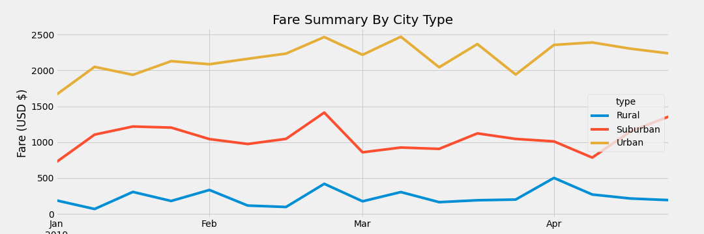

# Ride_Share_Analysis

## Overview
The purpose of this analysis is to provide a visualization on ride share fares by city type. 

## Analysis
There were multiple things I have noticed amongst the data provided. 
* The number of total drivers in order from least to most is Rural, Surburban and then Urban
* The average fare per ride in order from most expensive to least expensive is Rural, Surburban and Urban
* The fare trend over time stays farely consistent 

## Summary
Based on the data provided  I can make the assumption that in areas with a lower population you would run into higher fares due to less drivers in the area. 
